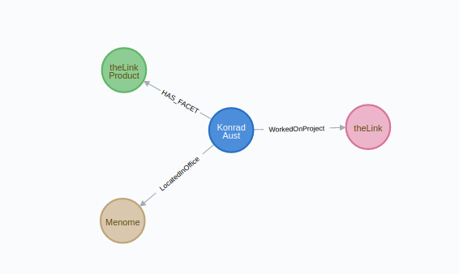
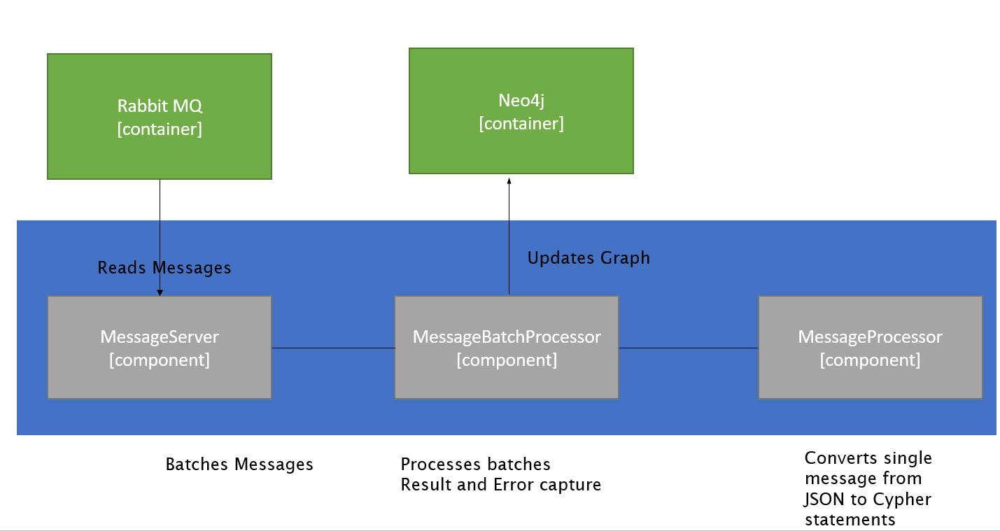

# Overview
This project reads messages in a specific structure from a RabbitMQ queue and converts them into Neo4J database graph updates 

# Example
```json5
  {
    "Name": "Konrad Aust",
    "NodeType": "Employee",
    "Priority": 1,
    "SourceSystem": "HRSystem",
    "ConformedDimensions": {
      "Email": "konrad.aust@menome.com",
      "EmployeeId": 12345
    },
    "Properties": {
      "Status": "active",
      "PreferredName": "The Chazzinator",
      "ResumeSkills": "programming,peeling bananas from the wrong end,handstands,sweet kickflips"
    },
    "Connections": [
      {
        "Name": "Menome Victoria",
        "NodeType": "Office",
        "RelType": "LocatedInOffice",
        "ForwardRel": true,
        "ConformedDimensions": {
          "City": "Victoria"
        }
      },
      {
        "Name": "theLink",
        "NodeType": "Project",
        "RelType": "WorkedOnProject",
        "ForwardRel": true,
        "ConformedDimensions": {
          "Code": "5"
        }
      },
      {
        "Name": "theLink Product Team",
        "NodeType": "Team",
        "Label": "Facet",
        "RelType": "HAS_FACET",
        "ForwardRel": true,
        "ConformedDimensions": {
          "Code": "1337"
        }
      }
    ]
  }
```

Resulting Cypher statements

```
CREATE INDEX ON :Employee(Email,EmployeeId)
CREATE INDEX ON :Card(Email,EmployeeId)

MERGE (office0:Office{City: param.City}) ON CREATE SET office0.Uuid = apoc.create.uuid(),office0.TheLinkAddedDate = datetime(), office0.Name= param.Name ON MATCH SET office0.Name= param.Name
MERGE (project1:Project{Code: param.Code}) ON CREATE SET project1.Uuid = apoc.create.uuid(),project1.TheLinkAddedDate = datetime(), project1.Name= param.Name ON MATCH SET project1.Name= param.Name
MERGE (team2:Team{Code: param.Code}) ON CREATE SET team2.Uuid = apoc.create.uuid(),team2.TheLinkAddedDate = datetime(), team2.Label= param.Label,team2.Name= param.Name ON MATCH SET team2.Label= param.Label,team2.Name= param.Name

MERGE (employee:Card:Employee {Email: param.Email,EmployeeId: param.EmployeeId}) ON CREATE SET employee.Uuid = apoc.create.uuid(),employee.TheLinkAddedDate = datetime(), employee.Status= param.Status,employee.Priority= param.Priority,employee.PreferredName= param.PreferredName,employee.SourceSystem= param.SourceSystem,employee.ResumeSkills= param.ResumeSkills,employee.Name= param.Name ON MATCH SET employee.Status= param.Status,employee.Priority= param.Priority,employee.PreferredName= param.PreferredName,employee.SourceSystem= param.SourceSystem,employee.ResumeSkills= param.ResumeSkills,employee.Name= param.Name WITH employee,param 
MATCH (office0:Office {City : param.office0City}) WITH employee,param,office0
MATCH (project1:Project {Code : param.project1Code}) WITH employee,param,office0,project1
MATCH (team2:Team {Code : param.team2Code}) WITH employee,param,office0,project1,team2
MERGE (employee)-[office0_rel:LocatedInOffice]->(office0)
MERGE (employee)-[project1_rel:WorkedOnProject]->(project1)
MERGE (employee)-[team2_rel:HAS_FACET]->(team2)
```

Resulting Graph



## Objectives
The primary objective of this project is to update the graph as fast as possible. 
- Messages are streamed off of the Rabbit queue into batches. The batch size defaults to 5,000 but can be configured (see Environment/Configuration Variables below.) 
- Each batch is processed in its own thread. 

## Principals

#### Immutability 
Given that each batch will be processed by a thread, I wanted to ensure there was no state kept in the objects. To that end, I opted to adopt some principals from the functional programming world. The first one being immutability. In my processing framework, once an object is created it's not modified. This is done by convention as there aren't too many immutable data structures in Java/Groovy. There are other pure functional languages implemented on the JVM Clojure (Lisp based) and Frege(a Haskel) being two of the more popular functional languages. Scala is another option, but it's more of an Object/Functional hybrid. 

#### Pure Functions
Another aspect of a functional approach is ensuring functions don't have side effects. That is given a set of arguments, the function is guaranteed to return the same value and won't impact the 'outside' world. There are no language semantics to express this concept in Java/Groovy so again this is by convention. I opted to implement all behaviour as static functions. This helps enforce statelessness in the objects as static functions can't access instance variables in a class. In the classes I've implemented, there aren't any instance variables so this point is moot, however it's good practice to enforce this at the class level. The system does perform logging at various levels which does violate the no side effect principal, but that's an acceptable exception in my opinion.   

#### No Shared Mutable State
Given the two principals of immutability and pure functions the goal is not to have any shared state which could be mutated. This is particularly important when we have multiple threads in play. Sharing state that could be mutated in multiple threads is a recipe for disaster. 

#### Test Driven
There are a number of tests that validate the correctness of the implementation. They were developed in concert with the code. In many cases, tests were written before the implementation. Tests are implemented using the Spock BDD framework (http://spockframework.org/) 


## Technology

- JVM (Open JDK Version 17.0.X) (https://openjdk.java.net/)
- Groovy (Version:4.0.6) (https://groovy-lang.org/)
- Micronaut (Version 3.7.3) (https://micronaut.io/)
- Project Reactor (https://projectreactor.io/)
- RabbitMQ (https://www.rabbitmq.com/)
- Neo4J (https://neo4j.com/)
- Docker (https://www.docker.com/)

Testing
- Spock (http://spockframework.org/)
- Test Containers (https://www.testcontainers.org/)
        

## Solution Overview
The message processing solution consists of three primary classes, a few utility classes and tests in the form of Spock specifications. This section describes each of the major components, how they relate and anything significant about them. 

At a high level, the system reads messages from a Rabbit MQ queue, collects the message stream into batches, converts each entry in the batch to a series of Neo4J Cypher statements and applies the batch in a single transaction to update the graph database.




### Message Server
The MessageServer (com.menome.MessageServerCommand) is the main entry point for the system. It can be launched from the command line, through an iIDE (IntelliJ for example) or packaged into a docker container.

When the server starts, it will check to ensure it can connect to both Rabbit MQ and Neo4J. Status messages are  logged to standard out via the Logback logging framework at INFO level.  Here is a typical startup sequence:

```
10:43:40.149 [main] INFO  i.m.context.env.DefaultEnvironment - Established active environments: [cli]
10:43:40.587 [main] INFO  c.m.datarefinery.DataRefineryServer -  __  __
10:43:40.588 [main] INFO  c.m.datarefinery.DataRefineryServer - |  \/  | ___ _ __   ___  _ __ ___   ___
10:43:40.588 [main] INFO  c.m.datarefinery.DataRefineryServer - | |\/| |/ _ \ '_ \ / _ \| '_ ` _ \ / _ \
10:43:40.588 [main] INFO  c.m.datarefinery.DataRefineryServer - | |  | |  __/ | | | (_) | | | | | |  __/
10:43:40.588 [main] INFO  c.m.datarefinery.DataRefineryServer - |_|  |_|\___|_| |_|\___/|_| |_| |_|\___|
10:43:40.588 [main] INFO  c.m.datarefinery.DataRefineryServer - Starting Server
10:43:40.588 [main] INFO  c.m.datarefinery.DataRefineryServer - Starting Monitoring Services
10:43:40.887 [main] INFO  io.micronaut.runtime.Micronaut - Startup completed in 292ms. Server Running: http://localhost:8080
10:43:40.915 [main] INFO  com.menome.util.RabbitMQ - Connecting to RabbitMQ server 127.0.0.1 on port 5672 with user menome
10:43:40.965 [main] INFO  c.m.datarefinery.DataRefineryServer - Connected to Rabbit MQ Server OK
10:43:40.986 [main] INFO  com.menome.util.Neo4J - Connecting to Neo4J server bolt://localhost:7687 with user neo4j
10:43:41.194 [main] INFO  c.m.datarefinery.DataRefineryServer - Connected to Neo4J Database Server OK - version:4.0.4 edition:community
10:43:41.201 [main] INFO  c.m.datarefinery.DataRefineryServer - Message Server waiting for messages on queue test_queue processing messages with a batch size of 5000
10:43:41.267 [main] INFO  c.m.datarefinery.DataRefineryServer - Server Started
10:43:41.278 [rabbitmq-receiver-connection-subscription-2] INFO  reactor.rabbitmq.Receiver - Consumer amq.ctag-cp44adLvVKbIvBXYyKrSCg consuming from test_queue has been registered
```

A couple of things to note
- The monitoring server starts first. it's the one running at port 8080 above.
- The rabbit connection is established next. If successful it will display Connected to Rabbit MQ Server OK 
- The Neo4J connection is established next. If successful it will display Connected to Neo4J Database Server Ok with the version and edition of the Neo4J instance.
- Finally, the queue the server is listening on, and the batch size has been configured are displayed.

The server sets up a Reactive stream to listen for messages on the Rabbit queue. 

```groovy
RabbitFlux.createReceiver(receiverOptions).consumeAutoAck(ApplicationConfiguration.rabbitMQQueue)
        .map({ rabbitMsg -> new String(rabbitMsg.getBody()) })
        .bufferTimeout(ApplicationConfiguration.rabbitMQBatchSize, Duration.ofSeconds(2))
        .map({ messages -> MessageBatchProcessor.process(messages, driver) })
        .map({ messageBatchResult -> logBatchResult(messageBatchResult) })
        .subscribe()
```

Messages flow in, their contents are pulled out into Strings.
The buffer fills until the batch size is met or two seconds have elapsed.
The batch is sent to the MessageMatchProcessor.
The results are logged. 

 
### Message Batch Processor 
The message batch processor takes a batch of messages (currently an Arraylist<String>). Messages are grouped into maps of the same type. This is to ensure we can apply the same parameter type across all messages. In many cases the batch will have exactly the same message types, but we can't be guaranteed of that.

The messages in each sub batch are processed. 
- Indexes for the nodes in the batch are created if they are not present in the database.
- Connection nodes are merged. This is an optimization that assumes that the cardinality between primary nodes and their connections is low. That is to say, if we have connections to things like code descriptions or cities, there will be fewer of them than the primary nodes we are inserting. Merging them once instead of for each statement is efficient.  
- Parameters for each of the primary nodes are collected into a list. An UNWIND is prepended to the primary node merge and the batch is sent off to Neo4J.

#### Error Handling
One of the interesting aspects to this approach is what happens if there is an error or multiple errors in the batch? The batch is processed in a single transaction and as such, the entire batch will be rolled back. This is not ideal, we want to identify the messages that failed but let the valid ones proceed. When an error in a batch is detected, the batch is split in two and then each subset of the batch is processed again. This splitting happens until the batch size is one which will contain the invalid message. This approach was inspired by Git bisect.
 
### Message Processor
The message processor converts the JSON formatted messages into Neo4J cypher statements. There are three different types of statements that get created from a single message. 
- Create indexes for the primary node
- Merges for the connection node
- Merge and relationships to the connection nodes from the primary node.

There really isn't anything remarkable about this class. Lots of map processing, string manipulation etc. It is the heart of the approach and gets called for every message that the system consumes. Attempts have been made to make the methods as efficient as they can be. Likely more can be done here however it's not uncommon for a message to be processed in a few milliseconds. The bulk of the time is Neo4J processing the batches.

### Utility Classes
Neo4J - contains methods for establishing connections to and running cypher statements against the Neo4J database.

RabbitMQ - contains methods for establishing connections to the Rabbit MQ message bus.

## Gradle
The project is built using Gradle (https://gradle.org). All of the external dependencies are declared and managed through the build.gradle file at the root of the project.


## How to Build/Run 

Ensure you have a JDK installed (version 17+). I highly recommend SDKMan (https://sdkman.io/) to manage Java and related tooling versions. 

Execute the following from the command line

```shell script
./gradlew build
```
----

To run the tests execute:

```shell script
./gradlew test
```

You can review the results of the test run by opening the index.html file found at build/reports/tests/test/index.html

----
To start the server and have it listen for Rabbit messages on the queue

```shell script
./gradlew run
```

## Building a Docker Image
In the root directory of the project there is a Dockerfile. It can be used to build a docker image to run the server.

```shell script
./gradlew clean assemble shadowJar
docker build -t menome/message-server:v1 .
docker run -p 8080:8080 -e RABBITMQ_HOST=<RABBITMQ_HOST_IP_ADDRESS> -e NEO4J_HOST=<NEO4J_HOST_IP_ADDRESS> menome/message-server-1.0:latest
```
   

## Environment/Configuration Variables
These are the environment variables that are used by the message server to configure the connections to Rabbit MQ and Neo4J. See the ApplicationConfiguration class for the implementation.

|Environment Variable       | Default Value |
|---                        |---------------|
|RABBITMQ_HOST              | localhost     |
|RABBITMQ_PORT              | 5672          |
|RABBITMQ_USER              | menome        |
|RABBITMQ_PASSWORD          | menome        |
|RABBITMQ_QUEUE             | test_queue    |
|RABBITMQ_BATCH_SIZE        | 5000          |
|RABBITMQ_EXCHANGE          | test_exchange |
|                           |               |
|NEO4J_HOST                 | localhost     |
|NEO4J_BOLT_PORT            | 7687          |
|NEO4J_USER                 | neo4j         |
|NEO4J_PASSWORD             | password      |
|                           |               |
|REDIS_HOST                 | localhost     |
|REDIS_PORT                 | 6379          |
|                           |               |
|SHOW_CONNECTION_LOG_OUTPUT | Y             |
|HTTP_SERVER_PORT           | 8081          |    
|                           |               |
|ENABLE_METRICS             | N             |

## Docker Compose
There is a docker-compose.yml in the root of the project that can be used to spin up  message server, neo4j and rabbitmq containers. After doing a docker build as illustrated above

```shell script
docker compose up
```

This will pull down the required images and start them up, setting up default users, ports etc.

Below is the end of the compose logs. You should see something similar. These two messages indicate that the message server can connect to RabbitMQ and Neo4j

```shell script
message-server-message-server-1  | 21:57:12.846 [main] INFO  com.menome.MessageServerCommand - Connected to Neo4J Database Server OK - version:4.0.3 edition:community
message-server-message-server-1  | 21:57:12.847 [main] INFO  com.menome.util.Redis - Connecting to Redis Host:localhost on Port:6379
```

```shell script
neo4j                            | 2022-11-11 21:57:04.876+0000 INFO  Starting...
neo4j                            | 2022-11-11 21:57:12.555+0000 INFO  Called db.clearQueryCaches(): Query cache already empty.
neo4j                            | 2022-11-11 21:57:12.613+0000 INFO  Bolt enabled on 0.0.0.0:7687.
neo4j                            | 2022-11-11 21:57:12.613+0000 INFO  Started.
message-server-message-server-1  | 21:57:12.846 [main] INFO  com.menome.MessageServerCommand - Connected to Neo4J Database Server OK - version:4.0.3 edition:community
message-server-message-server-1  | 21:57:12.847 [main] INFO  com.menome.util.Redis - Connecting to Redis Host:localhost on Port:6379
message-server-message-server-1  | 21:57:12.920 [main] INFO  com.menome.MessageServerCommand - Unable to connect to Redis cache. Connection node caching is disabled
message-server-message-server-1  | 21:57:12.925 [main] INFO  com.menome.MessageServerCommand - Message Server waiting for messages on queue test_queue processing messages with a batch size of 500
message-server-message-server-1  | 21:57:12.980 [main] INFO  com.menome.MessageServerCommand - Server Started
rabbitmq                         | 2022-11-11 21:57:12.983739+00:00 [info] <0.666.0> accepting AMQP connection <0.666.0> (172.19.0.2:48494 -> 172.19.0.3:5672)
rabbitmq                         | 2022-11-11 21:57:12.985168+00:00 [info] <0.666.0> connection <0.666.0> (172.19.0.2:48494 -> 172.19.0.3:5672) has a client-provided name: test_queue
rabbitmq                         | 2022-11-11 21:57:12.985862+00:00 [info] <0.666.0> connection <0.666.0> (172.19.0.2:48494 -> 172.19.0.3:5672 - test_queue): user 'menome' authenticated and granted access to vhost '/'
message-server-message-server-1  | 21:57:12.988 [rabbitmq-receiver-connection-subscription-1] INFO  reactor.rabbitmq.Receiver - Consumer amq.ctag-qg04yer_kXEnkxXVIKVVcA consuming from test_queue has been registered
neo4j                            | 2022-11-11 21:57:13.241+0000 INFO  Remote interface available at http://0.0.0.0:7474/
message-server-message-server-1  | 21:58:28.201 [default-nioEventLoopGroup-1-2] INFO  com.menome.util.RabbitMQ - Connecting to RabbitMQ server rabbitmq on port 5672 with user menome
rabbitmq                         | 2022-11-11 21:58:28.203885+00:00 [info] <0.679.0> accepting AMQP connection <0.679.0> (172.19.0.2:33176 -> 172.19.0.3:5672)
rabbitmq                         | 2022-11-11 21:58:28.206556+00:00 [info] <0.679.0> connection <0.679.0> (172.19.0.2:33176 -> 172.19.0.3:5672): user 'menome' authenticated and granted access to vhost '/'
```

See the docker-compose.yml file for the specific ports/user ids and passwords used to provision the containers. 
                 

## Installing docker and docker compose into a new Ubuntu 22.10 instance

The following is provided as an illustration of getting the message server up and running on a brand new installation with just docker and docker compose.


```shell script
  apt-get update
  apt-get upgrade
  apt install apt-transport-https ca-certificates curl software-properties-common
  curl -fsSL https://download.docker.com/linux/ubuntu/gpg | sudo gpg --dearmor -o /usr/share/keyrings/docker-archive-keyring.gpg
  echo "deb [arch=$(dpkg --print-architecture) signed-by=/usr/share/keyrings/docker-archive-keyring.gpg] https://download.docker.com/linux/ubuntu $(lsb_release -cs) stable" | sudo tee /etc/apt/sources.list.d/docker.list > /dev/null
  apt update
  apt-cache policy docker-ce
  apt install docker-ce
  systemctl status docker
  mkdir -p ~/.docker/cli-plugins/
  curl -SL https://github.com/docker/compose/releases/download/v2.3.3/docker-compose-linux-x86_64 -o ~/.docker/cli-plugins/docker-compose
  chmod +x ~/.docker/cli-plugins/docker-compose
  docker compose version
  take message-server
  touch docker-compose.yml 
  # open docker-compose.yml in an editor (nano, vim, emacs whatever) and replace contents with docker-compose.yml contents in this repository 
  
  docker login
  # your docker hub login must have access to the menome repository in order to pull the menome/message-server:latest image 
  
  docker compose up
  
  # Have the message server generate a bunch of test messages.
  wget http://localhost:8081/GenerateTestMessages/50000


```

## Generating Test Messages from a server end point
It might be helpful to generate a bunch of test messages to evaluate the configuration and to check the server performance. 

The following URL will generate n messages

```
http://server:HTTP_SERVER_PORT/GenerateTestMessages/<number of message>
```
 
For example:

```
wget http://localhost:8081/GenerateTestMessages/50000
```

Will generate 50,000 test messages

## Deleting Test Messages
Removing the test messages from the Neo4J server can be done via the following endpoint

```
http://server:HTTP_SERVER_PORT/DeleteTestMessages
```
 
For example:

```
wget http://localhost:8081/DeleteTestMessages
```

Will delete all nodes from Neo4J that have a node with a property of SourceSystem with a value of menome_test_framework 

The code behind this endpoint is the equivalent of executing this cypher statement:
 
```match (n) where n.SourceSystem='menome_test_framework' detach delete n```


## TODO. Update this section with Java 17 specific instructions. 

> ### Jenkins Configuration
> There is a Jenkins pipeline defined for the project (See Jenkinsfile in the root of the project)
> There is some setup required on the Jenkins server for each JDK
> 
> (Replace the specific versions below with the version you want to install. This is provided as an example and is already installed on the Jenkins server)
> 
> ```
> ssh root@jenkins.menome.com
> su jeknins
> cd jdks
> wget wget https://github.com/AdoptOpenJDK/openjdk11-binaries/releases/download/jdk-11.0.7%2B10/OpenJDK11U-jdk_x64_linux_hotspot_11.0.7_10.tar.gz
> tar -xvf OpenJDK11U-jdk_x64_linux_hotspot_11.0.7_10.tar.gz
> rm OpenJDK11U-jdk_x64_linux_hotspot_11.0.7_10.tar.gz
> ```
> 
> In Jenkins 
> 
> - Global Tool Configuration
> - Add JDK
> - Uncheck install automatically
> - Set JAVA_HOME to /var/lib/jenkins/jdks/jdk-11.0.7+10
> 
> Update Jenkinsfile with the label defined in the global tool setup
> 
> ```
> tools {
>     jdk "jdk-11.0.7"
> }
> ``` 
> 
## NOTE - TODO: Exchange type is currently hardcoded

The RMQ exchange type needs to be changed to be configurable rather than DIRECT only. 
       rabbitChannel.exchangeDeclare(exchange, "direct", true) // TODO: make exchange type configurable